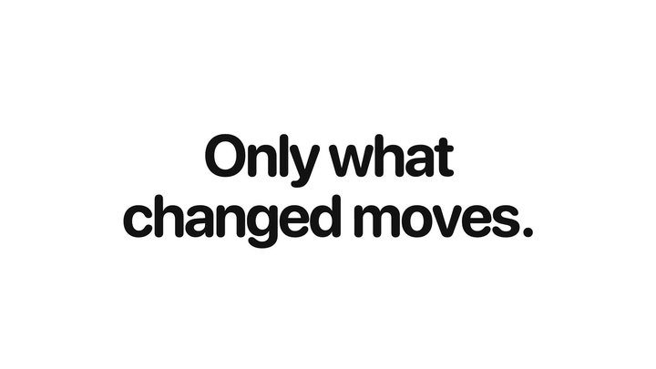

# lunato



The motion layer for AI interfaces. Streamed answers, agent status, live captions and rewrites change their minds as they go; lunato moves only the words that changed. One function, zero dependencies, any framework.

```
npm i lunato
```

## Usage

```ts
import { morphChanges } from "lunato";

const stop = morphChanges("#price"); // <span id="price">$20</span>
price.textContent = "$24"; // the 0 rolls to a 4, the rest holds still
stop(); // the element is plain again
```

Bind once, then change the content however you like: `textContent`, `innerHTML` or a framework render.

## API

```ts
morphChanges(target: string | Element | null): () => void
```

- `target`: an element or a CSS selector. `null` is ignored, so the function can be passed straight to a ref.
- Returns a function that stops watching and puts the element back as it was.
- Binding the same element again replaces the first binding. Safe with StrictMode, hot reload and server imports.
- There are no options. The element's own CSS is the look.

## Frameworks

```tsx
<span ref={morphChanges}>{price}</span>          // React 19
<span {@attach morphChanges}>{price}</span>      // Svelte 5
<span v-morph-changes>{{ price }}</span>         // Vue: import { vMorphChanges } from "lunato"
<span ref={morphChanges}>{price()}</span>        // Solid: import { morphChanges } from "lunato/solid"
```

In Vue, `vMorphChanges` registers by name in `<script setup>`, or app-wide with `app.directive("morph-changes", vMorphChanges)`.

Anywhere else, use the element:

```html
<script type="module">import "lunato/element";</script>
<lunato-text>$240</lunato-text>
```

## Use cases

### A streamed answer

```tsx
function Answer({ text }: { text: string }) {
  return <p ref={morphChanges}>{text}</p>;
}
```

Each new word rises in as it arrives. When the model revises what it wrote, only the words it changed move.

### Agent status

```tsx
<span ref={morphChanges} aria-live="polite">{status}</span>
```

`"Reading 4 sources"` to `"Reading 9 sources"` rolls the 4 and nothing else.

### Counts and prices

```tsx
<span ref={morphChanges} style={{ fontVariantNumeric: "tabular-nums" }}>
  {tokens.toLocaleString()} tokens
</span>
```

Digits pair by place value from the decimal point, like an odometer: 99 to 100 rolls both 9s to 0 and brings in only the 1. Falling numbers roll down.

### Send and stop

```tsx
<button ref={morphChanges} aria-label={busy ? "Stop" : "Send"} onClick={busy ? stop : send}>
  {busy ? <StopIcon /> : <SendIcon />}
</button>
```

The icon morphs into the next one. Emoji and any other icon shrink and blur across.

### A line icon that reshapes

```tsx
const Menu = () => (
  <svg viewBox="0 0 24 24" stroke="currentColor" strokeWidth="2" strokeLinecap="round">
    <line x1="4" y1="7" x2="20" y2="7" />
    <line x1="4" y1="12" x2="20" y2="12" />
    <line x1="4" y1="17" x2="20" y2="17" />
  </svg>
);
const Close = () => (
  <svg viewBox="0 0 24 24" stroke="currentColor" strokeWidth="2" strokeLinecap="round">
    <line x1="6" y1="6" x2="18" y2="18" />
    <line x1="18" y1="6" x2="6" y2="18" />
  </svg>
);

<button ref={morphChanges}>{open ? <Close /> : <Menu />}</button>
```

Each line travels to the line nearest it, and the spare one folds into the centre.

### A reaction

```tsx
<button ref={morphChanges}>{emoji} {count}</button>
```

👍 12 to 🎉 13: the emoji blurs into the next one while the 2 rolls to a 3.

### A rewrite or a live caption

```ts
morphChanges(caption);
caption.textContent = "We can ship it on Friday";
caption.textContent = "We can ship it on Thursday morning"; // "We can ship it on" holds still
```

Unchanged words hold still, however many edits sit between them.

## What moves

- **Text.** Unchanged words hold still. Inside a changed word, shared letters stay. Changes sweep left to right a word at a time. When kept words have to move, what leaves goes first, the rest glide into its room, and new words land last. A word pushed onto another line fades across instead of flying over the text.
- **Numbers.** Digits pair by place value from the decimal point and roll. Falling numbers roll down.
- **Emoji and icons.** Shrink and blur into the next one.
- **Line icons.** An svg of up to three `<line>`s, with a `viewBox`, morphs into another, and turns when it is the same drawing rotated. After Benji Taylor's [Morphing icons with Claude](https://benji.org/morphing-icons-with-claude).
- **Outline icons.** An svg of up to four simple shapes (path, rect, circle, ellipse, line, polyline, polygon) reshapes outline to outline, so a play triangle becomes two pause bars.

## Components

The vault on lunato's site has AI interface pieces built with it, each with its motion finished: AI inputs, send buttons, model pickers, effort meters, thinking states and loaders, code changes, research sources, image generation, streaming text and token meters. They are React 19 and Tailwind v4, one file each, to copy into your project and change as you like.

## Styling

The element's CSS is the look. Use `font-variant-numeric: tabular-nums` on numbers. Motion never draws outside the element, and its width eases to fit.

## Accessibility

The real text stays in the DOM for screen readers, search and selection; the animation is an `aria-hidden` overlay. Add `aria-live="polite"` if a change should be announced. Reduced motion turns every change into a plain fade.

## Limits

- A rotation around the element skews the morph; a scale does not.
- The width only eases on one-line text.
- `text-shadow` and `text-decoration` paint under the animation.
- Text painted with `background-clip: text` shows twice: the gradient still paints through the hidden originals under the moving copies. Animate `color` instead.

## Prior art

[Scritto](https://scrit.to) by Jace inspired the rolls. [torph](https://torph.lochie.me) by Lochie morphs text through framework components. lunato's code, numbers and API are its own.

## License

MIT
