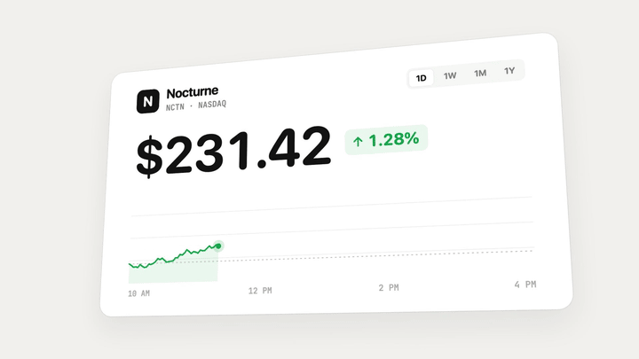
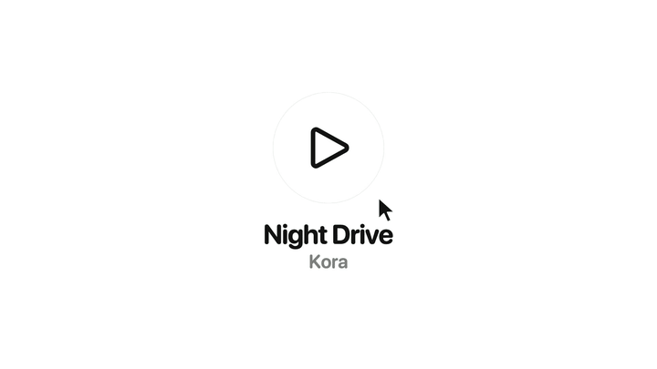
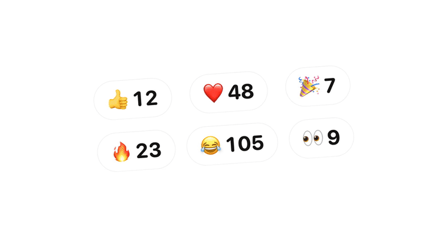

# lunato


Change an element's text and only what changed moves. Letters, numbers, emoji and icons. One function, zero dependencies.

```
npm i lunato
```

## Usage

```ts
import { morphChanges } from "lunato";

morphChanges("#price");
price.textContent = "$24"; // the 0 rolls to a 4, the rest holds still
```

Call it once, then change the content however you like. It returns a function that undoes it.

## Frameworks

```tsx
<span ref={morphChanges}>{price}</span>          // React 19
<span {@attach morphChanges}>{price}</span>      // Svelte 5
<span v-morph-changes>{{ price }}</span>         // Vue, with vMorphChanges imported
<span ref={morphChanges}>{price()}</span>        // Solid, from "lunato/solid"
```

Anywhere else, use the element:

```html
<script type="module">import "lunato/element";</script>
<lunato-text>$240</lunato-text>
```

Safe with StrictMode, hot reload and server imports.

## What moves

<p>
  
  
</p>


- **Text.** Unchanged words hold still, however many edits sit between them, so a caption correcting itself only moves the words that changed. Inside a changed word, shared letters stay too.
- **Numbers.** Digits pair from the right like an odometer, so 9 to 10 rolls the 9 and brings in only the 1. Falling numbers roll down.
- **Emoji and icons.** Shrink and blur into the next one.
- **Line icons.** An svg of up to three `<line>`s morphs into another, turning when it is the same drawing rotated. After Benji Taylor's [Morphing icons with Claude](https://benji.org/morphing-icons-with-claude).
- **Outline icons.** An svg of up to four simple shapes reshapes outline to outline, so a play triangle becomes two pause bars.

## Styling

No options: the element's CSS is the look. Use `font-variant-numeric: tabular-nums` on numbers. Motion never draws outside the element, and its width eases to fit.

## Accessibility

The real text stays in the DOM for screen readers, search and selection; the animation is an `aria-hidden` overlay. Reduced motion becomes a plain fade.

## Limits

- A rotation around the element skews the morph; a scale does not.
- The width only eases on one-line text.
- `text-shadow` and `text-decoration` paint under the animation.

## Prior art

[Scritto](https://scrit.to) by Jace inspired the rolls. [torph](https://torph.lochie.me) by Lochie morphs text through framework components. lunato's code, numbers and API are its own.

## License

MIT
